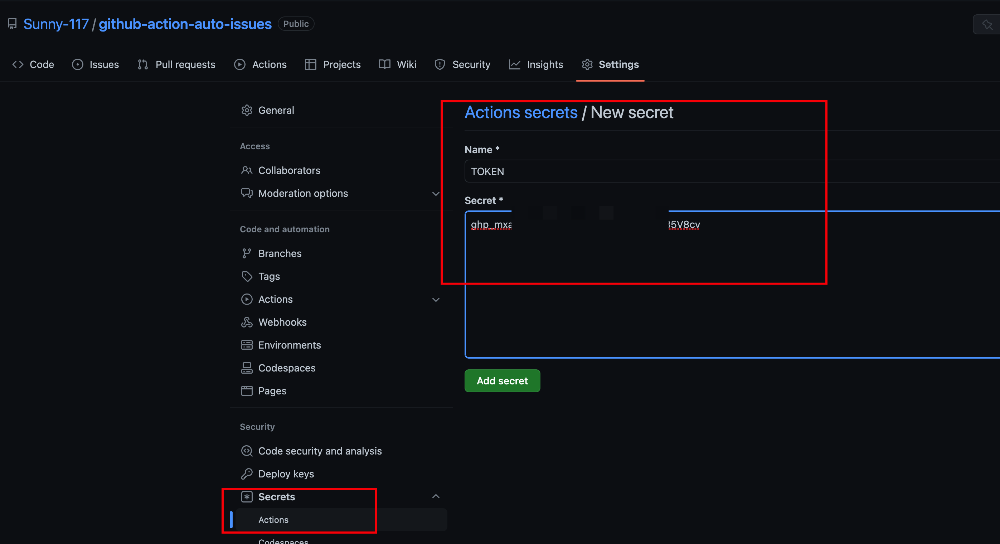

# github-action-auto-issues

使用 Github Actions 来完成自动创建 issues 任务

# V1

每日自动创建 issues

自动执行
使用 js 来创建 issues

[配置链接](https://github.com/cuixiaorui/study-every-day/blob/main/.github/workflows/main.yml)